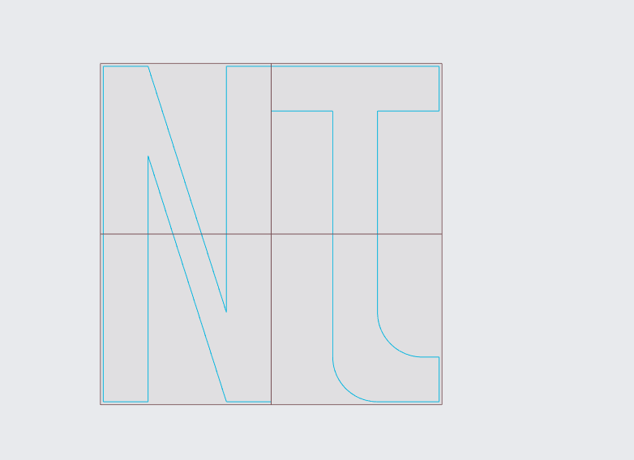
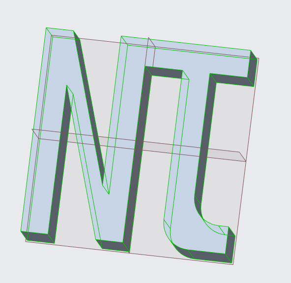
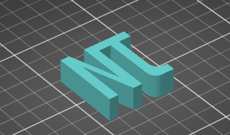
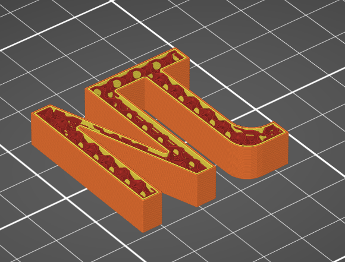
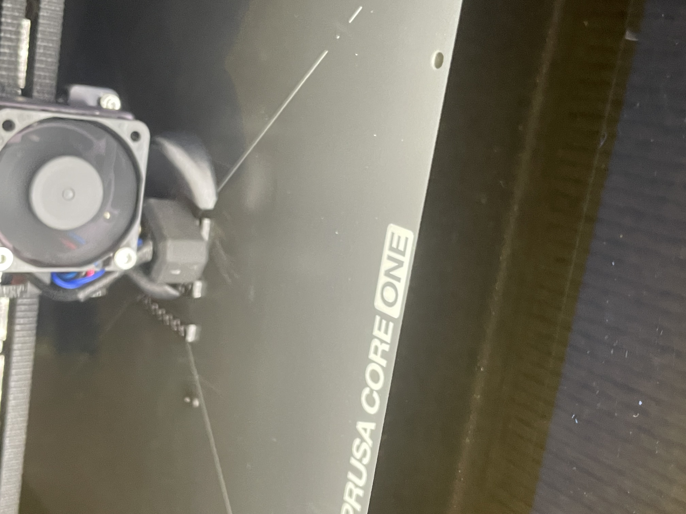
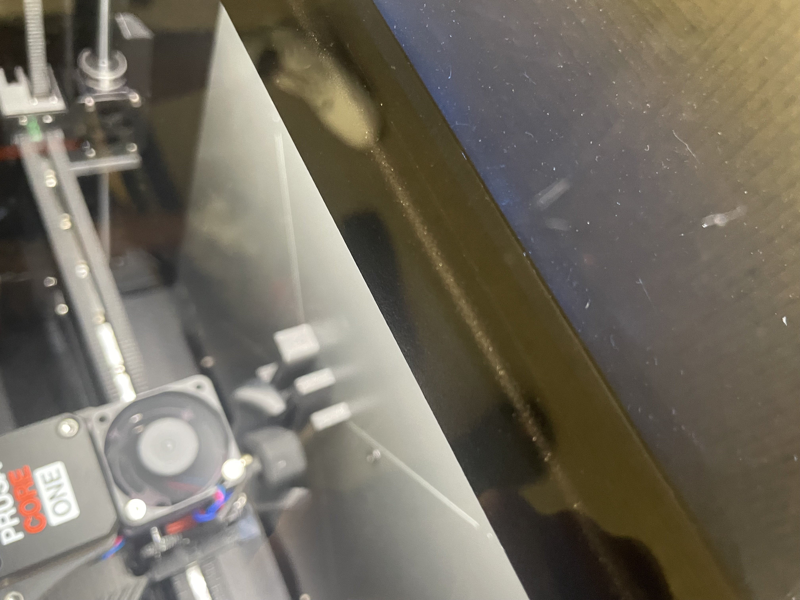
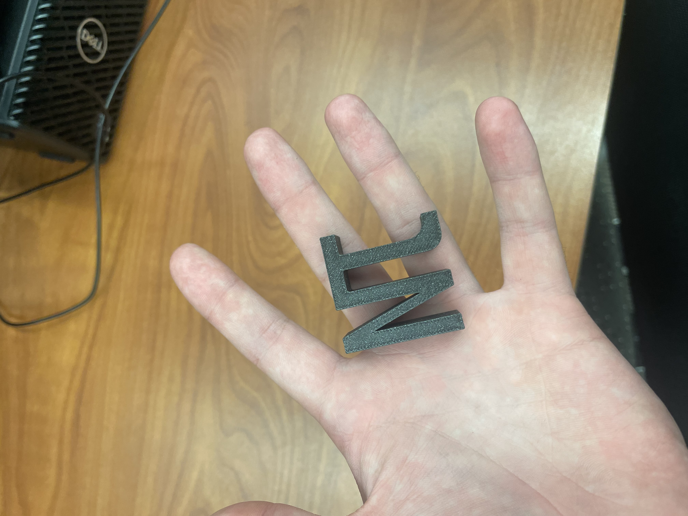

# Lab 3 – Custom Monogram 3D Print

## Objective
The goal of this project was to design, slice, and 3D print a small custom monogram object ("NJ") while adhering to specific sizing and manufacturing constraints. The design features a flipped, backwards 'J' to improve visual symmetry and balance, creating a cohesive single-shape monogram.

---

## Design
The monogram was designed using Creo Parametric 12.4. 

* **CAD Modeling:** The sketch features custom geometric constraints to create the merged "NJ" monogram. A backwards 'J' was deliberately used to balance the composition visually.
* **Dimensions & Constraints:** The part was extruded within the required envelope (under 0.5 inches tall and fitting within 1.5 inches by 1.5 inches), ensuring no overhangs so supports were unnecessary.

  
*Figure 1: Initial 2D sketch in Creo Parametric 12.4 showing the inverted J monogram.*

  
*Figure 2: 3D extruded model ready for slicing.*

---

## Preprocessor and Printing
The CAD model was exported to STL format and prepared using PrusaSlicer.

* **Build Orientation & Scaling:** The flat base was placed directly on the print bed to eliminate overhangs and maximize bed adhesion. No scaling was required as the CAD model was designed to exact specifications.
* **Wall Thickness & Perimeter:** Wall thickness was set to 2 perimeters to balance outer shell strength with total print time.
* **Infill Strategy:** Selected a **20% Gyroid infill pattern**. Gyroid provides isotropic strength across all three axes while maintaining minimal material usage and fast print speed.
* **Slicer Metrics:**
  * **Layer Height:** 0.20 mm
  * **Material:** PLA
  * **Estimated Print Time:** ~25 minutes

  
*Figure 3: Monogram layout and orientation on the build plate in PrusaSlicer.*

  
*Figure 4: 20% Gyroid infill visualization.*

---

## Analyze
To fulfill the research requirements, the following section details mechanical properties and infill comparisons:

### 1. Infill Research (3 Types Not Covered in Class)
* **Concentric:** Follows the outer wall perimeter inward in concentric rings. Best for flexible materials (like TPU) or components requiring maximum flexibility under compression, though weak under shear forces.
* **Lightning:** Generates a tree-like internal scaffolding supporting upper flat surfaces/roofs only. Used for purely decorative prints where structural integrity is not needed, drastically reducing print time and material.
* **Adaptive Cubic:** Dynamically varies infill density, making internal areas hollow while increasing density near top surfaces and edges. Ideal for large structural models needing targeted reinforcement without wasting filament in low-stress cores.

### 2. Answers to Live Demo Questions
* **How does percentage infill affect mechanical properties?**  
  Higher infill percentage directly increases compressive strength, shear resistance, and overall part mass. However, strength gains plateau around 40–50% for standard applications, yielding diminishing strength-to-weight returns past that point.
* **How do different infill patterns affect mechanical properties?**  
  Patterns affect directional strength (anisotropy vs. isotropy). Grid and rectilinear infills are strong along major axis grids but weak under diagonal shear. Isotropic patterns like Gyroid distribute stress uniformly in 3D, resisting forces from all angles equally.
* **Why use different wall thicknesses?**  
  Wall thickness (perimeter count) has a much higher impact on structural rigidity and tensile strength than internal infill density. Increasing wall thickness adds significant strength against outer bending and impact forces without needing a high infill density.

---

## Decide
During the production process, adjustments were made to ensure a successful build:

* **Attempt 1 Failure:** The first print was started on a printer with bed-leveling and extrusion issues, resulting in layer separation and detachment from the build plate.
* **Attempt 2 Correction:** Switched to a secondary tuned FDM printer in the UNCC print farm, re-cleaned the print bed, and re-ran the slice job.

  
*Figure 5: Failed first prototype due to printer bed adhesion issues.*

  
*Figure 6: Re-assigning the print job to a secondary FDM printer.*

  
*Figure 7: Successful base layer and initial perimeters on the second attempt.*

  
*Figure 8: Second prototype near completion with clean top layers.*

  
*Figure 9: Completed 3D printed "NJ" monogram.*

---

## Communicate

### Video Demonstration
[Watch 3D Print Operation Video](IMG_3462.jpeg)

---

## Lessons Learned

### 1. Scaling Decisions to Safety-Critical Applications
Applying low infill (20%) or thin wall choices to structural or load-bearing parts in safety-critical applications (e.g., automotive brackets or aerospace components) could lead to sudden shear failure or stress fatigue under cyclic loads. High-stress functional parts require wall thickness optimization and higher isotropic infill patterns (or solid fills) calculated via Finite Element Analysis (FEA).

### 2. Mistakes Caught and Preventative Strategies
* **Caught Mistake:** A bad printer bed setup caused initial detachment. Moving to an operational printer resolved this immediately.
* **Undetected Flaw:** A subtle CAD flaw—such as an ultra-thin wall junction where the inverted 'J' meets the 'N'—might not fail in slicing, but could act as a stress concentration point during use. Implementing an automated pre-flight wall thickness check in CAD before exporting STL files would prevent this in future workflows.

### 3. Real-World Parallel
Internal structural webbing in modern automotive bumpers mirrors 3D infill strategies. Instead of solid plastic, engineers use ribbed grid patterns to maximize energy absorption and structural integrity during an impact while minimizing weight and material costs.

* **Total Time to Complete:** ~2.5 hours (including CAD design, slicer setup, troubleshooting printer hardware, and documentation).

---

## Resources
* [Prusa Knowledge Base: Infill Patterns](https://help.prusa3d.com/article/infill-patterns_177130) – Overview of 20% Gyroid strength-to-weight benefits and isotropic mechanical characteristics.
* [Formlabs: 3D Print Infill Optimization Guide](https://formlabs.com/blog/3d-printing-infill-patterns-density/) – Analysis on why 20% infill provides optimal mechanical efficiency and why wall thickness drives overall part strength.
* Creo Parametric 12.4 Documentation
* PrusaSlicer Documentation
