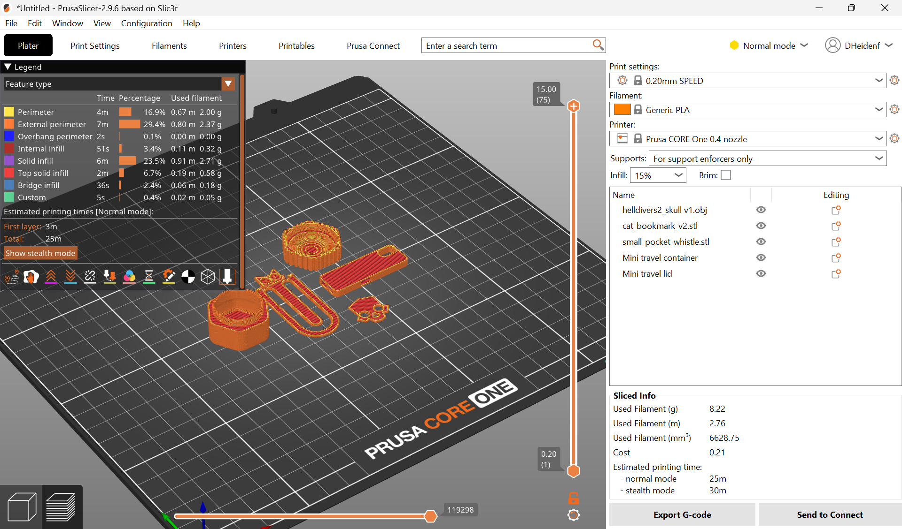
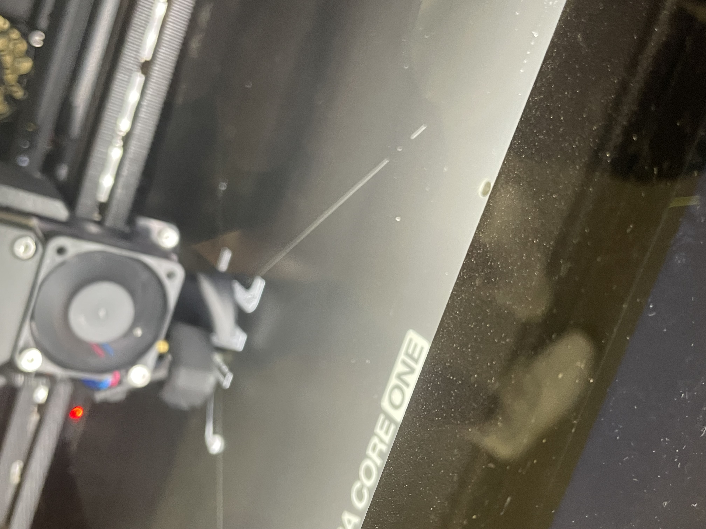
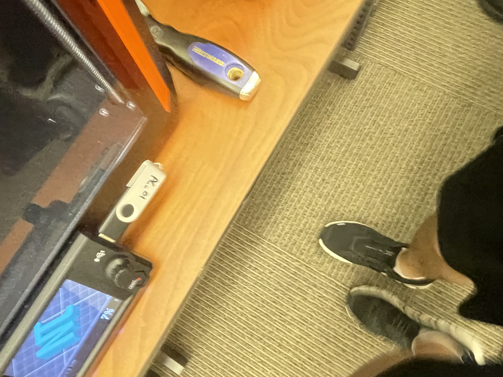

# Lab 4: Benchmark a Parameter

## Objective
The objective of this lab is to design, slice, print, and evaluate a custom benchmark artifact to determine the physical manufacturing limits of the Prusa Core One 3D printer. By characterizing specific machine constraints, we establish empirical design rules necessary for reliable FDM additive manufacturing.

---

## Parameter

- **Tested Parameter:** Overhang Angle Limit (Degrees from vertical: 45°, 55°, 65°, 70°, and 75° without support structures).
- **Hypothesis / Prediction:** I predict that the Prusa Core One will maintain clean surface finish up to 60°. Above 60°, slight sagging or loop dropping is expected, and at 75°, significant strand separation will occur due to gravity exceeding layer adhesion on severe overhangs.

---

## Document Design

### Design Process & Iteration
To benchmark overhang limits cleanly, a step-like cantilevered test artifact was designed with progressive overhang angles.

1. **CAD Modeling:** Created a single-body test block in CAD featuring angled faces from 45° to 75° relative to the vertical build axis.
2. **Feature Sizing:** Kept the total artifact size compact to ensure the print time remains under the 1-hour machine limit.
3. **Identification Markers:** Embossed degree labels on each step face to easily identify failing angles post-print.

*Figure 1: CAD model and dimension layout of the overhang benchmark artifact.*

*Figure 2: Initial feature concepts evaluated during the benchmark design phase.*

---

## Preprocessor

The model was loaded into **PrusaSlicer** to configure print parameters tailored specifically for testing overhang boundaries.

*Figure 3: PrusaSlicer build orientation, layer preview, and print metrics.*

### Build Parameter Justifications
- **Infill (15% Grid):** Selected to provide minimal structural support to top layers without wasting material or extending print time unnecessarily.
- **Build Orientation (Flat Base Alignment):** The part was oriented flat on its largest rectangular face so that overhang angles point away from the build plate, ensuring true unsupported bridging during the print.
- **Supports (Disabled):** Supports were intentionally set to **None**. Enabling supports would invalidate an overhang boundary benchmark.
- **Scaling (100% / Native Scale):** No scaling was applied as the designed bounding dimensions ($50 \text{ mm} \times 20 \text{ mm} \times 30 \text{ mm}$) natively keep the print time under 30 minutes.
- **Print Metrics:** Estimated time ~28 minutes; estimated material ~8.5 grams of PLA.

### Process Notes & Adjustments
- Ensured part positioning was centered on the build plate to receive even thermal distribution from the heated bed.

---

## Print Artifact

### Execution & Results
- **Printer Assigned:** UNCC Print Farm – Prusa CORE One
- **Material Used:** Generic PLA
- **Test Results:** The artifact successfully printed up to 60° with clean surface quality. Minimal sagging was observed at 70°, and distinct loop drooping occurred at 75°, confirming the printer's functional limit for unsupported geometry.

*Figure 4: Completed overhang benchmark artifact on the print bed.*

*Figure 5: Detailed view of overhang faces showing quality progression across angles.*

> **Note:** A 15-second process video showing the active print of the benchmark artifact has been recorded and embedded for evaluation.

---

## Lessons Learned

1. **Overhang Performance vs. Prediction:** The Prusa Core One performed slightly better than predicted, holding acceptable surface quality up to 65° before noticeable deformation occurred at 70°–75°.
2. **Comparison to Design Rules:** Class FDM design rules specify a maximum unsupported overhang of 45°. The empirical test demonstrated that while 45° is optimal for high visual quality, angles up to 60° are functionally achievable on the Prusa Core One without active support structures.
3. **Cooling Fan Impact:** Part cooling fan speed directly dictates overhang success; high, consistent airflow is critical for solidifying extruded filament before gravity pulls it down.
4. **Future Design Adjustments:** In future models, chamfers should be kept under 50° whenever possible to maintain smooth surface finishes without requiring support cleanup.

### Workflow Time
- **Total Time Elapsed:** ~55 minutes (15 min CAD/Slicing + 28 min Print + 12 min Inspection/Documentation).

---

## Resources

- [Prusa CORE One Specifications & User Manual](https://help.prusa3d.com/) – Hardware capabilities and slicing recommendations.
- **Class Design Rules for 3D Printing Chart** – FDM manufacturing tolerances and overhang limits reference.
