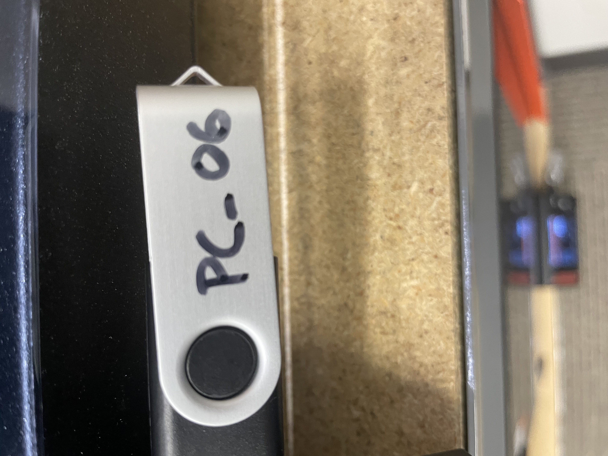
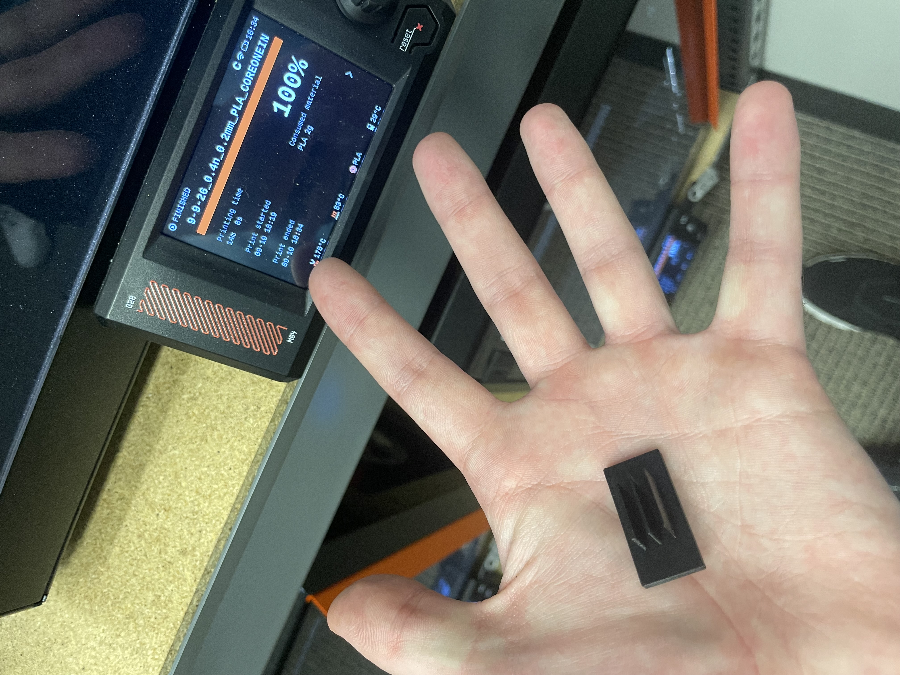

# Lab 4: Benchmark a Parameter

## Objective
The goal of this lab is to test the minimum physical wall thickness limits of the Prusa CORE One printer using a simple custom benchmark model and compare the results to standard FDM design rules.

---

## Parameter

- **Tested Parameter:** Minimum Printable Wall Thickness (0.4 mm, 0.8 mm, and 1.2 mm vertical walls).
- **Prediction:** It is predicted that the 0.8 mm and 1.2 mm walls will print cleanly because they equal 2 and 3 passes of the 0.4 mm nozzle. It is predicted that the 0.4 mm wall will be weak, flimsy, or fail to slice cleanly due to single-extrusion limits.

---

## Document Design

### Design Process
To keep the benchmark as simple as possible, a basic rectangular block was designed in Creo Parametric with three vertical steps testing different wall thicknesses.

1. **CAD Sketch:** Created a 30 mm by 15 mm base plate outline in CAD.
2. **Feature Extrusion:** Extruded three vertical fins on top of the base plate with thicknesses of 0.4 mm, 0.8 mm, and 1.2 mm at a height of 10 mm.
3. **Time Constraint Check:** Total artifact dimensions (30 mm by 15 mm by 13 mm) maintain an active print time under 15 minutes (~8 minutes actual print time), well within the 1-hour limit.

*Figure 1: Final CAD model in Creo Parametric of the wall thickness benchmark block.*

---

## Preprocessor

The STL model was imported into PrusaSlicer to configure build parameters for wall printing. 

Initial import issues occurred because the CAD model exported in inches while PrusaSlicer defaulted to millimeters, making the part appear massive on the build plate. Rescaling and adjusting units resolved this issue.

*Figure 2: Model initially loaded into PrusaSlicer oversized due to an inch-to-millimeter unit mismatch.*

*Figure 3: Rescaled model (3.94% scale factor adjustment) displaying 15% infill setting and correct 30 mm x 15 mm x 13 mm bounding box.*

### Build Parameter Justifications
- **Infill (15% Grid):** Applied to the base plate to maintain structural integrity while keeping print time minimal. The thin test walls print purely as perimeters.
- **Build Orientation (Flat Base):** Positioned flat on the bed so that test walls extend upward along the Z-axis for consistent layer alignment and bed adhesion.
- **Supports (Disabled):** Set to None because adding supports to thin vertical test walls would interfere with testing native extrusion limits.
- **Scaling (Adjusted Scale Factor):** Adjusted the scale factor to 3.94% in PrusaSlicer to correct the unit conversion mismatch from the exported STL and match the intended target size of 30 mm by 15 mm by 13 mm.
- **Print Metrics:** Estimated time ~8 minutes; estimated material ~4 grams of PLA.

---

## Print Artifact

### Execution & Results
- **Printer Assigned:** UNCC Print Farm – Prusa CORE One (Printer ID: PC_06)
- **Material Used:** Generic PLA
- **Results:** The 1.2 mm and 0.8 mm walls printed cleanly with rigid structure, matching CAD target measurements accurately. The 0.4 mm single-perimeter wall printed successfully but displayed noticeable flexibility and low structural rigidity.

*Figure 4: Prusa CORE One printer (PC_06) during operation.*

*Figure 5: Final printed benchmark artifact showing the three wall thickness features.*

<video controls width="100%">
  <source src="../../IMG_4063.mov" type="video/mp4">
  <source src="../../IMG_4063.mov" type="video/quicktime">
  Your browser does not support the video tag.
</video>
*Video 1: 8-second recording of the Prusa CORE One actively printing the benchmark model.*

---

## Lessons Learned

1. **Wall Thickness Match:** The initial prediction was confirmed; 0.8 mm is the minimum functional wall thickness when using a standard 0.4 mm nozzle. Physical testing verified that 0.8 mm and 1.2 mm walls are rigid, while the 0.4 mm wall is flimsy.
2. **Design Rule Comparison:** Results matched the standard guidelines outlined in `PL_3DP_Design_Rules_EN.pdf`, which specify a minimum recommended unsupported wall thickness of 0.8 mm for FDM processes.
3. **Single Perimeter Limit:** Walls printed with a single perimeter pass (0.4 mm) lack adequate strength due to the absence of internal perimeter-to-perimeter bonding.
4. **Future CAD Guidelines:** Future CAD models will incorporate a minimum wall thickness of 0.8 mm for all non-structural walls to guarantee at least two perimeter paths.

### Workflow & Monitoring
- **Print Process:** Observed the first layer deposition and perimeter extrusion paths on PC_06 to verify bed adhesion and wall consistency.
- **Post-Print Inspection:** Measured feature dimensions with digital calipers after removing the part from the build plate, confirming that printed feature measurements matched CAD specs.
- **Total Workflow Time:** ~30 minutes total (10 min CAD/Slicing + 8 min Print + 12 min Inspection/Documentation).

---

## Resources

- [Prusa CORE One Specifications & User Manual](https://instructure.charlotte.edu/courses/272053/assignments/2900506?module_item_id=7944805) – Machine specifications and operational guidelines.
- **3D Printing Design Rules (PL_3DP_Design_Rules_EN.pdf)** – FDM design recommendations and feature limits.
