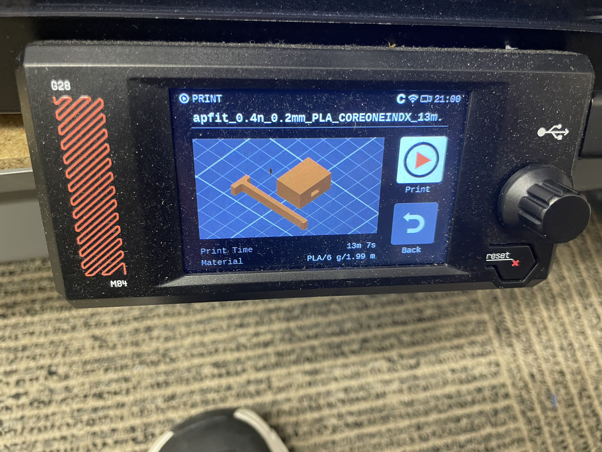
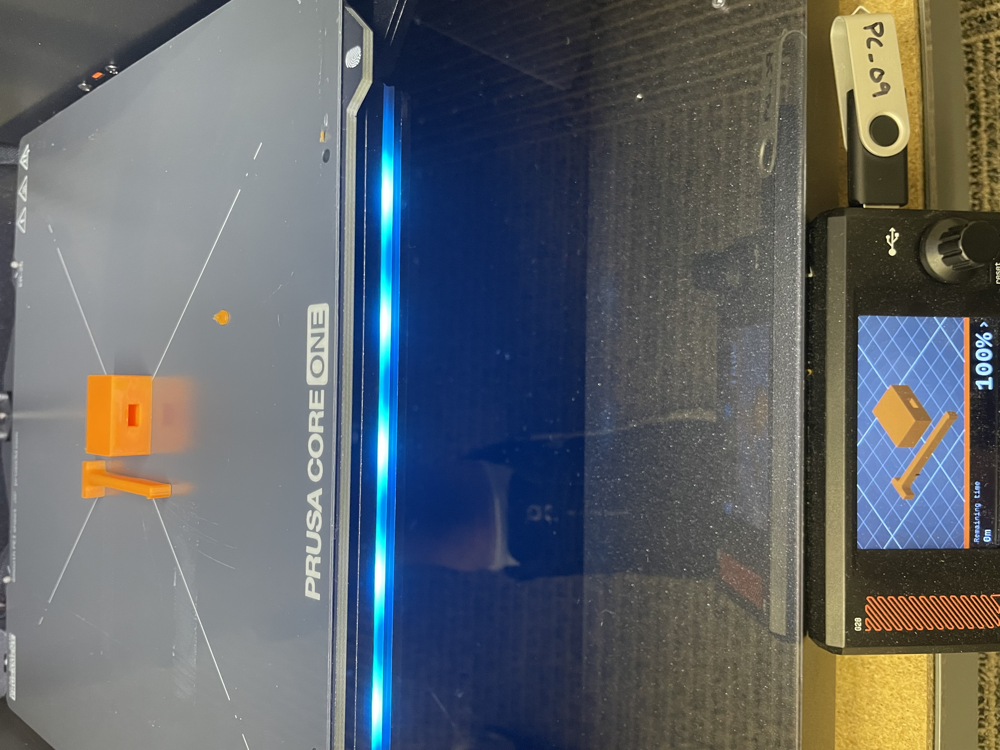
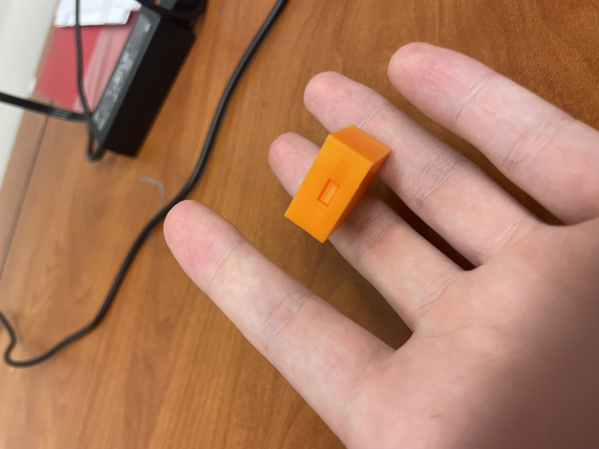
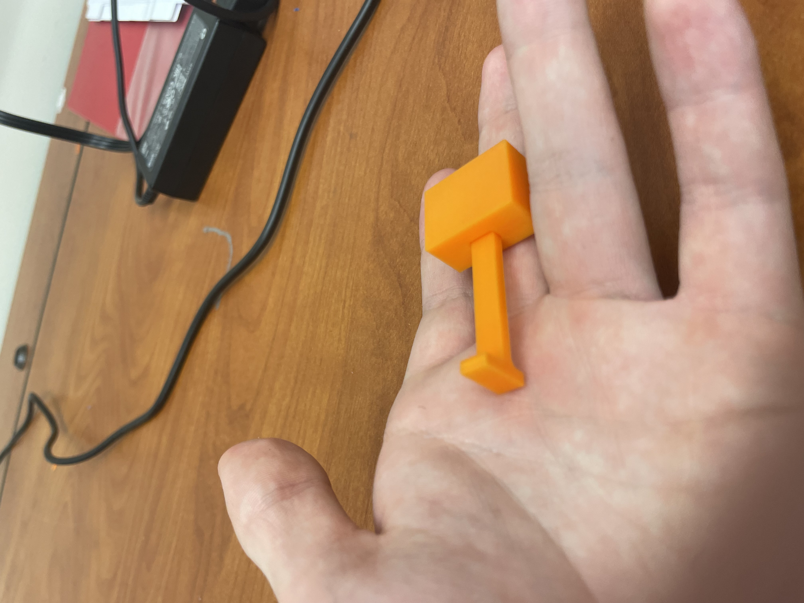

# Lab #5: Design a Snap Fit

## Design
The objective of this lab was to parametrically design, 3D print, and physically test a two-part snap-fit flexure assembly consisting of a cantilever male clip and a female receiving housing block. 

To achieve elastic deformation without permanent yielding, the flexure beam was designed with a 0.015 in clearance allowance. Sharp internal corners were rounded with fillets at the flexure root to minimize stress concentrations during bending.

---

## Research
According to the course module on [Layer Orientation and Part Strength](https://instructure.charlotte.edu/courses/272053/pages/layer-orientation-and-part-strength?module_item_id=8366449), FDM 3D printed parts are anisotropic, meaning the bond strength between printed layers is significantly weaker than the tensile strength along a single continuous extrusion line. 

For this flexure assembly, **Orientation A** (laying flat on the print bed) was selected. This orientation ensures that bending stress is distributed along continuous filament paths running parallel to the cantilever length rather than tensile stress acting directly across interlayer bonds at the flexure root.

---

## Modeling

### Material & Safety Parameters
* **Material:** PLA
* **Young's Modulus (E):** ~3.5 GPa (507,632 psi)
* **Yield Strength (σ_y):** ~60 MPa (8,702 psi)
* **Safety Factor (SF):** 3.5
* **Allowable Stress (σ_allow):** σ_y / 3.5 = 2,486 psi

### Load & Stress Calculations
1. **Transverse Load (P):** Selected at 1.5 lbf applied at the free end.
2. **Beam Length (L):** Solved using the cantilever deflection formula **δ = (P * L³) / (3 * E * I)** for target deflection equal to lip height.
3. **Bending Stress (σ_b):** Calculated at the flexure root base using **σ = (M * c) / I**. Verified that σ_b < σ_allow.
4. **Axial Stress (σ_a):** Calculated for an axial push/pull force between 5 lbf - 10 lbf using **σ_a = F / A**.
5. **Shear Stress (τ):** Solved for average shear stress across the engagement lip protrusion **τ = V / A_lip**.

---

## Parametric Design

### 1. Parameters Used
* `Slot_W`: Width of receiving channel in female block.
* `Slot_H`: Height of receiving channel in female block.
* `L`: Length of cantilever beam.
* `b`: Beam base width.
* `t`: Thickness of cantilever flexure.
* `h_lip`: Height of snap-fit locking overhang lip.

### 2. Parameter Justifications
These parameters allowed instant control over clearance allowances, beam flexure flexibility, and lock engagement without breaking overall model constraints.

### 3. Assigned Values
* `Slot_W`: 0.500 in
* `Slot_H`: 0.250 in
* `L`: 1.500 in
* `t`: 0.125 in (3.175 mm)
* `h_lip`: 0.040 in

### 4. Process Iterations
Initial clearance allowances were maintained at 0.015 in. Values remained constant in CAD prior to 3D printing.

### 5. CAD Model Progression

*Figure 1: Creo parameter table showing numerical relations and constraints for the male clip component.*

*Figure 2: Side view of the male flexure component modeled in Creo Parametric.*

*Figure 3: 3D CAD model of the female receiving block in Creo Parametric.*

*Figure 4: Parameter configuration table for the female block.*

### 6. Tolerance Decision-Making Process
A nominal clearance allowance of 0.015 in was engineered between the male slider beam and female channel to accommodate standard FDM nozzle extrusion width variances.

### 7. Final CAD Assembly

*Figure 5: Complete assembly model showing male clip aligned with female block.*

---

## 3D Printing & Test

### Pre-Processor Layout & Build Orientation
Both parts were placed flat on their side face on the print bed in PrusaSlicer. This layout minimizes Z-height, drastically reducing print time while aligning extrusion paths parallel to bending forces.

*Figure 6: Male clip and female block positioned flat on the print bed in PrusaSlicer.*

### Slicer Configuration & Settings
* **Perimeters:** Set to **4** (*Vertical shells*). Because the cantilever beam thickness is 3.175 mm, setting 4 perimeters converted the flexure into 100% continuous longitudinal wall paths for maximum fatigue resistance.
* **Infill:** Set to **25%** density with a **Gyroid** pattern for structural efficiency in the female block.
* **Supports:** Set to **For support enforcers only** with **Snug** support style to fulfill the lab requirement while keeping contact surfaces clean.

*Figure 7: Slicer vertical shells setting configured to 4 perimeters.*

*Figure 8: Infill configured to 25% Gyroid density.*

*Figure 9: Support configuration set to Enforcers Only with Snug style.*

*Figure 10: Complete sliced layer preview prior to G-code export.*

### Physical Print & Testing

* **Printer:** Printer PC-09
* **Print Time:** 13 minutes
* **Material Usage:** ~5.77 g PLA

*Figure 11: Printer screen preview of the G-code job before execution.*

*Figure 12: Both 3D printed parts completed on printer PC-09.*

#### Assembly & Fit Results
Upon post-processing, the male clip was inserted into the female housing block. Due to FDM horizontal plastic expansion (squish) and layer line surface friction, the fit was extremely tight, requiring firm impact force (hammering) to fully seat the locking lip. 

Once driven into position, the locking lip fully engaged inside the internal female undercut. The assembly locked permanently in place without cracking or snapping at the cantilever root base, demonstrating the extreme strength of horizontal build layer orientation under heavy stress.

*Figure 13: Assembled snap fit from Angle 1 demonstrating full lip engagement.*

*Figure 14: Assembled snap fit from Angle 2 showing locked retention.*

### Lessons Learned & Future Iterations
1. **FDM Tolerance Expansion:** Engineered CAD clearances of 0.015 in shrink significantly during printing due to plastic squish. In future iterations, expanding nominal clearance to 0.020 in - 0.025 in or applying a -0.1 mm XY Size Compensation in PrusaSlicer will allow smooth hand insertion.
2. **Structural Orientation Success:** Horizontal layer orientation proved 100% effective. Despite requiring heavy impact force to drive the clip home, the continuous longitudinal perimeters prevented flexure fracture.
