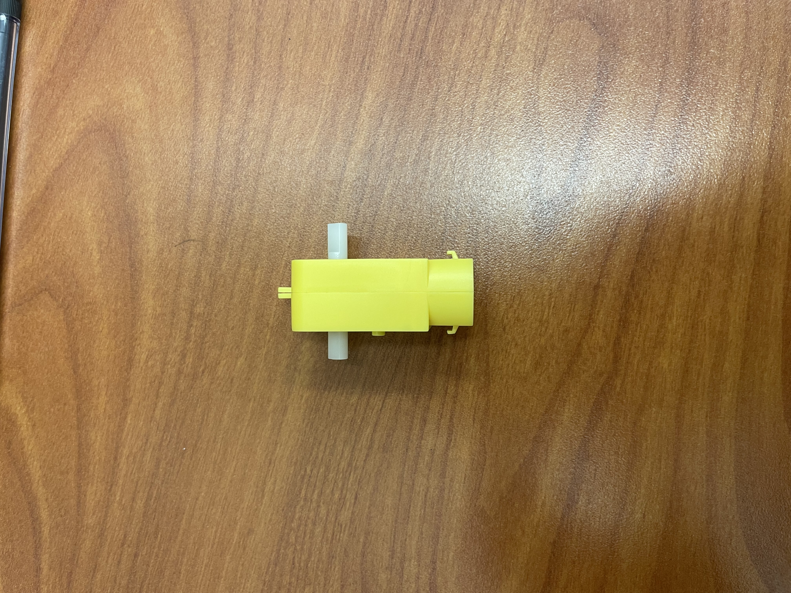
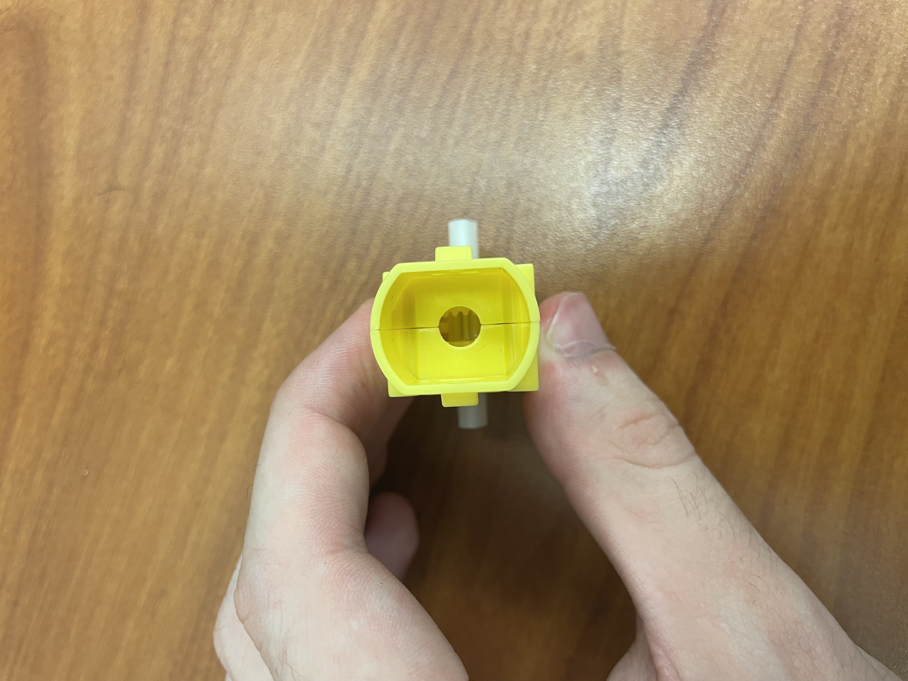
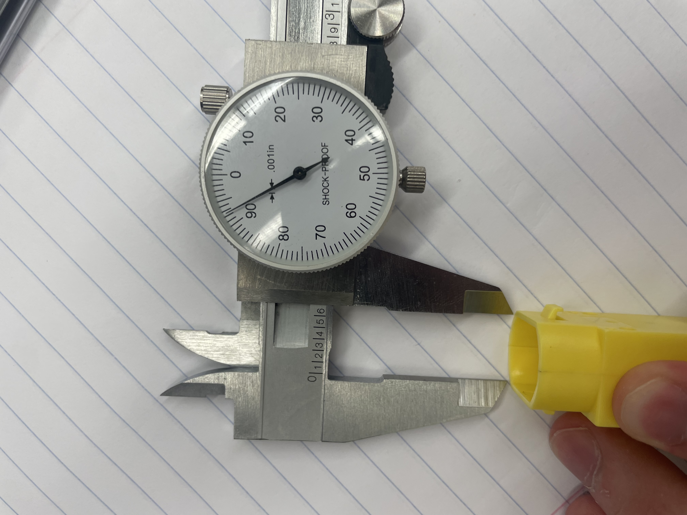
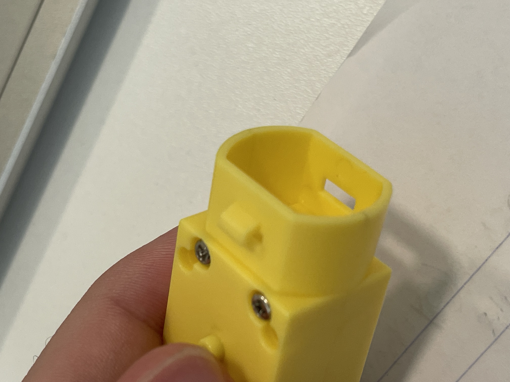
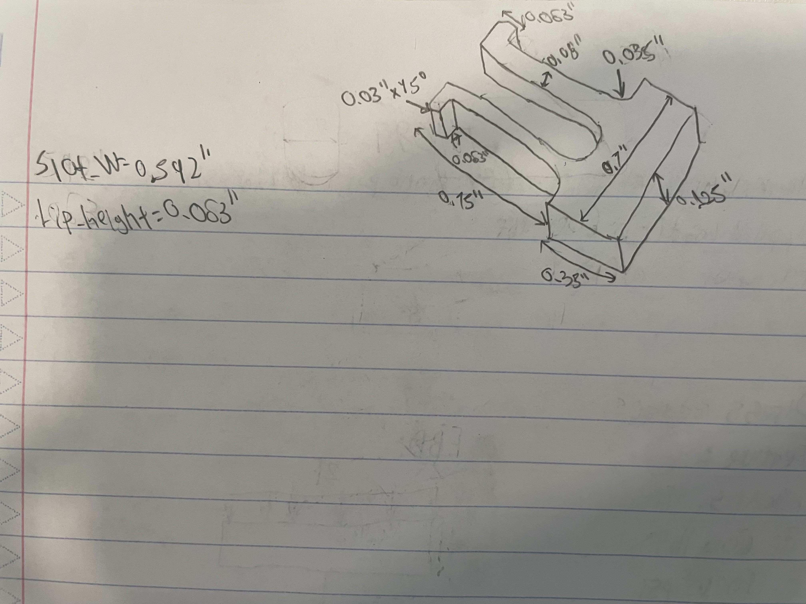
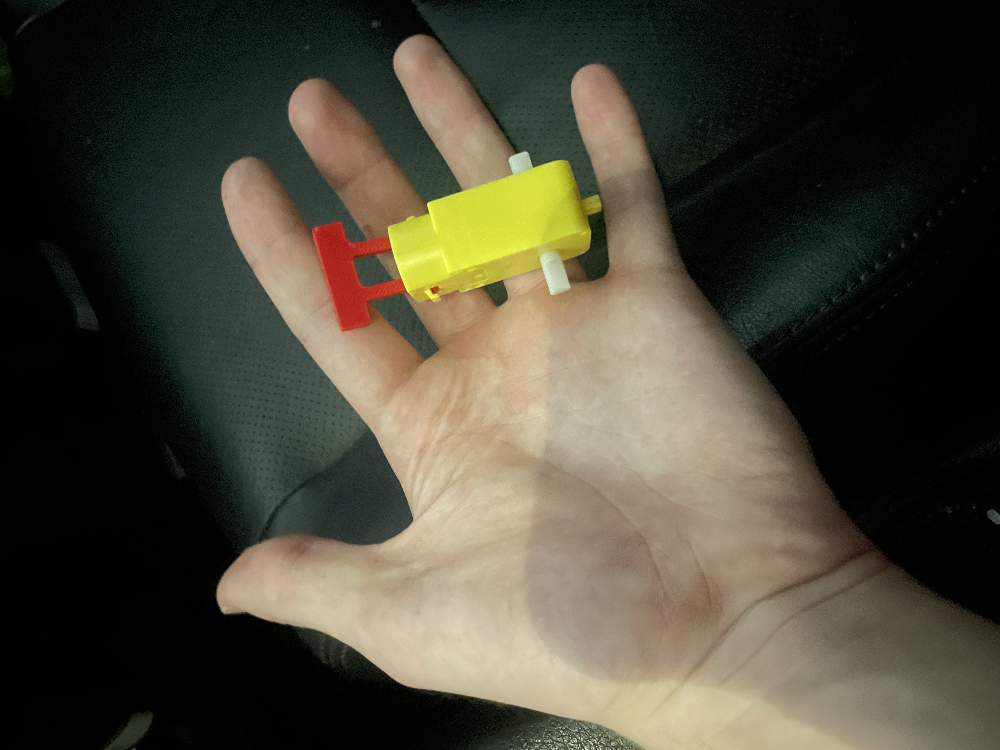

# Lab #6 Design Fits for an artifact

## Objective
Design and 3D print a small parametric snap-fit component in PLA that securely attaches to a feature on the yellow artifact. The design utilizes parameters, constraints, and engineered allowances in Creo Parametric, followed by proper slicer configuration in PrusaSlicer and physical verification on the artifact.

---

## Parametrically Design

### Research & Feature Measurement
Key dimensions were measured directly from the yellow artifact using digital calipers to establish the baseline parameters and tolerances for a proper fit.

* **Artifact Top View:** Shows the rectangular entry cavity and top housing structure.  
  

* **Artifact Frontal View:** Displays the front-facing entry profile and side window location.  
  

* **Slot Width Measurement (`Slot_W`):** Digital calipers measuring the main slot width ($0.592\text{ in}$).  
  

* **Side Window Latch Feature:** Detailed view of the narrow rectangular side hole where the locking lip must enter to catch and lock.  
  

### Hand Sketch & Feature Layout
An isometric hand sketch was created to outline the male snap-fit part, noting key parameters including `Slot_W = 0.592"` and `Lip_Height = 0.063"`.

### Creo CAD Modeling
The part was parametrically modeled in Creo Parametric using user-defined parameters, geometric constraints, and mathematical relations.

* **Creo Parameters Table:** Displays the defined variables, types, and values used to drive the part geometry.  
  

* **Initial CAD Concept:** Early CAD stage displaying full $0.350\text{ in}$ depth prior to adjusting for the side window.  
  

* **Final Optimized CAD Part:** Final shortened geometry ($0.125\text{ in}$ depth) ensuring the locking lips align directly with the narrow side window slots.  
  

### Design & Parameter Analysis
1. **What parameters were used?**
   * `Slot_W`: Measured main slot width ($0.592\text{ in}$).
   * `Flange_W`: Total width of the base stop block ($0.700\text{ in}$).
   * `Flange_H`: Height of the base stop block ($0.300\text{ in}$).
   * `Part_Y`: Depth of the part along the $Y$-axis ($0.125\text{ in}$).
   * `Arm_H`: Height of the vertical cantilever flexure arms ($0.750\text{ in}$).
   * `Arm_T`: Flexure arm wall thickness ($0.080\text{ in}$).
   * `Lip_Height`: Height of the latch tooth ($0.063\text{ in}$).
   * `Lip_Overhang`: Tooth protrusion distance ($0.063\text{ in}$).
   * `Fit_Clearance`: Engineered tolerance gap ($0.010\text{ in}$).

2. **Why were these specific parameters chosen?**  
   They capture the functional mating geometry of the yellow artifact while enabling the dual cantilever arms to flex inward upon insertion and expand outward into the side locking windows.

3. **What values were chosen for the parameters?**  
   `Slot_W = 0.592 in`, `Part_Y = 0.125 in`, `Arm_T = 0.080 in`, `Arm_H = 0.750 in`, `Lip_Height = 0.063 in`, `Lip_Overhang = 0.063 in`.

4. **Did the values change throughout the process? If so, why?**  
   Yes. The depth (`Part_Y`) was initially modeled at $0.350\text{ in}$ to match the main opening. However, inspecting the narrow side slot (`IMG_4120.jpeg`) showed that a full-depth lip would bind against the outer frame. The total part depth was shortened to $0.125\text{ in}$ so the locking lips extend across the full width of the arm and slide directly into the window.

5. **Engineered Allowances:**  
   A $0.010\text{ in}$ radial clearance allowance was applied to all mating faces to accommodate FDM PLA extrusion swelling and surface roughness, ensuring smooth mechanical engagement without jamming.

---

## Documentation

### Slicer Setup & Configuration
The CAD geometry was exported as an STL and configured in PrusaSlicer for printing on a Prusa printer.

* **Bed Layout & Orientation:** Model placed flat on its side on the build plate.  
  

* **Perimeter Settings:** Configured perimeter loops to enforce strong wall structural integrity across flexure arms.  
  

* **Infill Settings:** Configured infill density and pattern for lightweight rigidity.  
  

### In-Progress Printing Video
<video src="IMG_4124.MOV" controls width="100%"></video>

*Note: Short video recorded during active extrusion on printer PC-09 in the Rapid Lab.*

### Technical Printing Specifications
* **Machine Name:** PC-09
* **Print Size / Bounding Box:** $0.700\text{ in} \times 0.125\text{ in} \times 1.050\text{ in}$ ($17.78\text{ mm} \times 3.18\text{ mm} \times 26.67\text{ mm}$)
* **Build Orientation Rationale:** Positioned flat on its side so extruded filament paths run continuously down the length of the flexure arms. This forces bending stress to act perpendicular to layer lines, preventing layer-cleavage failure.
* **Supports Used:** None (laying the part flat eliminates all overhangs requiring support).
* **Wall Thickness / Perimeters:** 3 perimeter wall loops ($1.2\text{ mm}$ solid shell).
* **Layer Height:** $0.20\text{ mm}$ (Standard Quality).
* **Infill Density & Pattern:** 20% Grid Infill.

---

## Show and Tell

The printed part was verified on the yellow artifact feature during class. The lead chamfers guided the arms inward smoothly through the top slot, and the locking lips snapped firmly into the side window openings under light hand tension.

---

## Lessons Learned

1. **Layer Line Alignment Prevents Flexure Failure:** Cantilever arms printed vertically fail easily along layer boundaries when bent. Printing flat on its side directs stress across continuous extrusions, drastically improving fatigue resistance.
2. **Feature Alignment Simplifies Design:** Shortening the total depth from $0.350\text{ in}$ to $0.125\text{ in}$ allowed the entire arm to pass through the side window profile without requiring complex step-downs in CAD.
3. **CAD Units and Slicer Import:** Slicers default to millimeters, so exported inch-based STLs must be double-checked during slicing to ensure accurate 1:1 physical dimensions.
4. **Total Process Time & Resources:** Total project time was roughly 2.5 hours, including 1 hour for measurement/CAD modeling, 15 minutes for slicer setup, and 15 minutes for print execution on PLA material.
